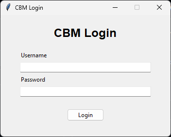
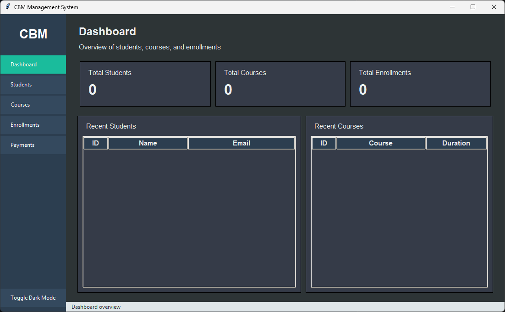
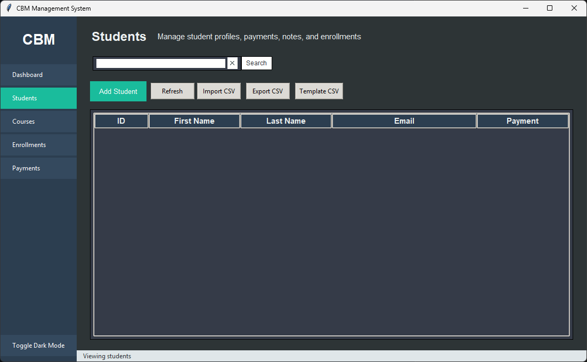
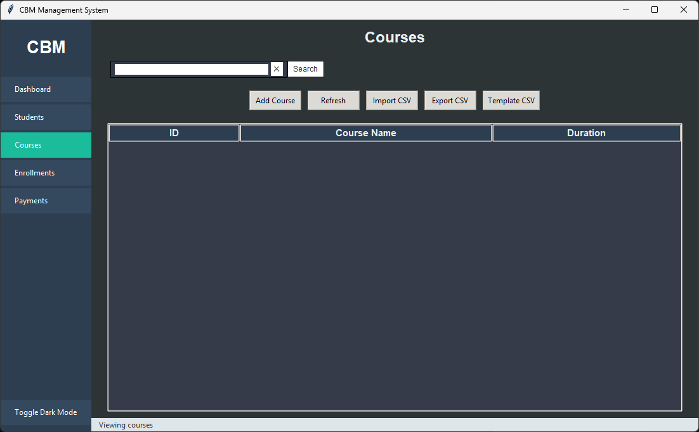
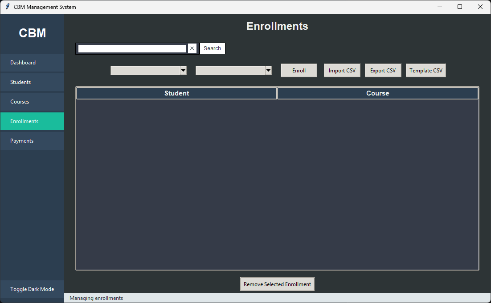
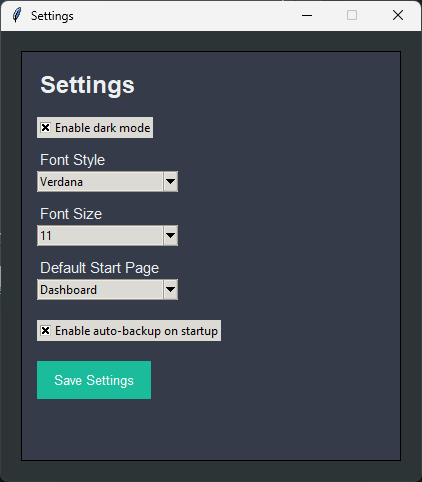

# CBM Management System

A desktop management application built with Python and Tkinter for managing students, courses, and enrollments.

## Features

### Core Functionality
- Student management (add, edit, delete)
- Course management
- Enrollment system (assign students to courses)
- Payment tracking

### Data Handling
- CSV import (students, courses, enrollments)
- CSV export (all data)
- Template generation for easy data input

### User Experience
- Sidebar navigation
- Search and filtering
- Dashboard with real-time statistics
- Recent activity overview
- Persistent settings (dark mode, window state, preferences)

### System Features
- Login system with hashed passwords
- Auto-backup system
- Manual database backup
- Settings panel (font, start page, behavior)

### UI
- Dark mode support
- Responsive layout (resizable window)
- Clean dashboard interface

---

## 📸 Screenshots

### Login


### Dashboard


### Students


### Courses


### Enrollments


### Settings


---

## Tech Stack

- Python
- Tkinter (GUI)
- SQLite (database)
- PyInstaller (packaging)

---

## Installation

### Run from source

```bash
pip install -r requirements.txt
python main.py
